# Grafana Dashboards

There are two dashboards to monitor Milvus databases managed by KubeDB.

- KubeDB / Milvus / Summary: Shows overall summary of the Milvus instance.
- KubeDB / Milvus / Pod: Shows individual pod-level information.

Note: These dashboards are developed in **Grafana version 7.5.5**

### Dependencies

Milvus Dashboards are heavily dependent on:

- [Prometheus Node Exporter](https://github.com/prometheus/node_exporter)
- [kube-state-metrics](https://github.com/kubernetes/kube-state-metrics)
- [Panopticon by Appscode](https://byte.builders/blog/post/introducing-panopticon/)

### Installation

#### 1. Install Prometheus Stack

Install Prometheus stack if you haven't done it already. You can use [kube-prometheus-stack](https://artifacthub.io/packages/helm/prometheus-community/kube-prometheus-stack) which installs the necessary components required for the Milvus Grafana dashboards.

#### 2. Install Panopticon

Install Panopticon if you haven't done it already. Like other AppsCode products, [Panopticon](https://byte.builders/blog/post/introducing-panopticon/) also need a license to run.

**If you already have a license for KubeDB or Stash, you do not need to issue a new license for Panopticon. Your existing KubeDB or Stash license will work with Panopticon.**

Now, install Panopticon using the following commands:

```bash
helm upgrade -i monitoring-operator oci://ghcr.io/appscode-charts/monitoring-operator \
  --version v2024.9.30 \
  -n monitoring --create-namespace

helm upgrade -i panopticon oci://ghcr.io/appscode-charts/panopticon \
  --version v2024.9.30 \
  -n monitoring --create-namespace \
  --set-file license=/path/to/license-file.txt
```

#### 3. Add monitoring configuration in KubeDB managed Milvus spec

To enable monitoring of a KubeDB Milvus instance, you have to add monitoring configuration in the Milvus CR spec like below:

```
apiVersion: kubedb.com/v1alpha2
kind: Milvus
metadata:
  name: sample-Milvus
  namespace: demo
spec:
  ...
  ...
  monitor:
    agent: prometheus.io/operator
    prometheus:
      serviceMonitor:
        labels:
          release: <helm-release-name-of-kube-prometheus-stack>
        interval: 10s
```

### Using Dashboards

#### Create DB Metrics Configurations

At first, you have to create a `MetricsConfiguration` object for DB. This `MetricsConfiguration` object is used by Panopticon to generate metrics for DB instances.

Install `kubedb-metrics` charts which will create the `MetricsConfiguration` object for DB:

```bash
helm upgrade -i kubedb-metrics oci://ghcr.io/appscode-charts/kubedb-metrics \
  --version v2024.9.30 \
  -n kubedb --create-namespace
```

#### Import Grafana Dashboard

Now, on your Grafana UI, import the json files of dashboards located in the `milvus` folder of this repository.

1. Select `Import` from the `Plus(+)` icon from the left bar of the Grafana UI


2. Upload the json file and hit load button:


If you followed the instruction properly, you should see the Milvus Grafana dashboard in your Grafana UI.

### Samples

####  KubeDB / Milvus / Summary
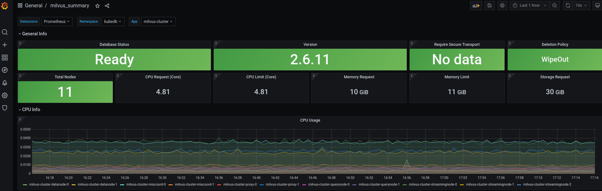
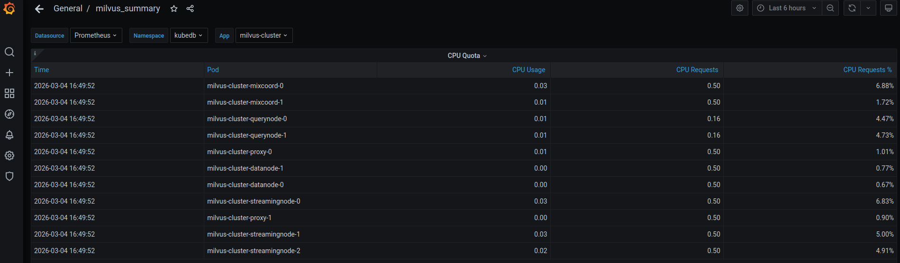
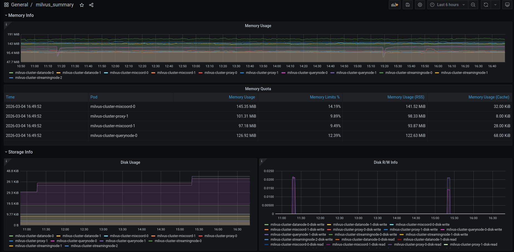
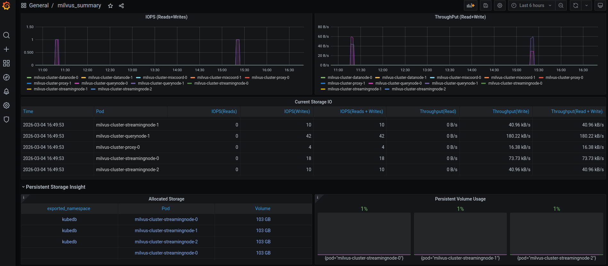
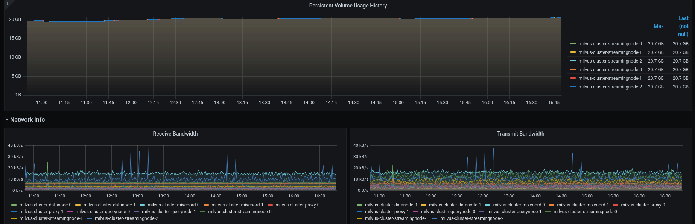

####  KubeDB / Milvus / Pod
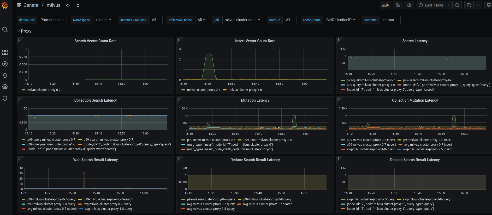
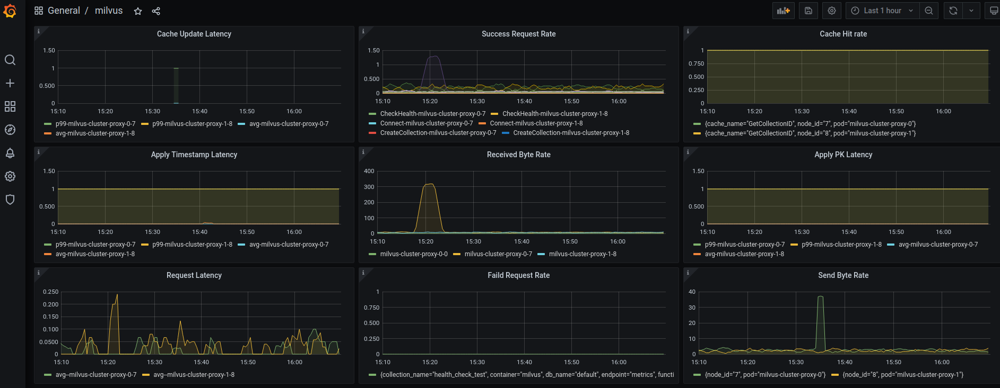
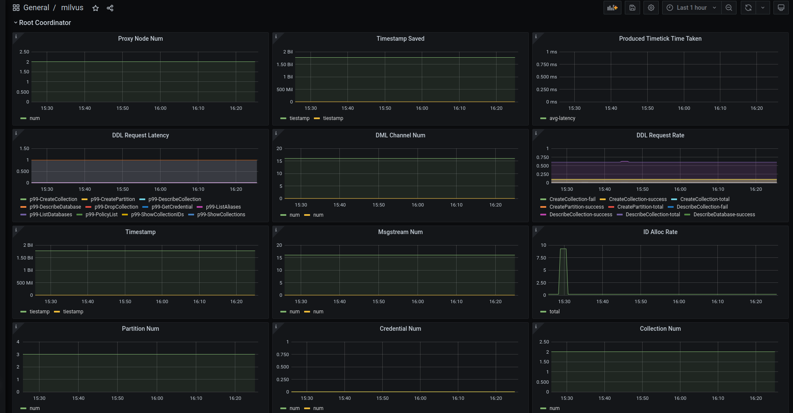
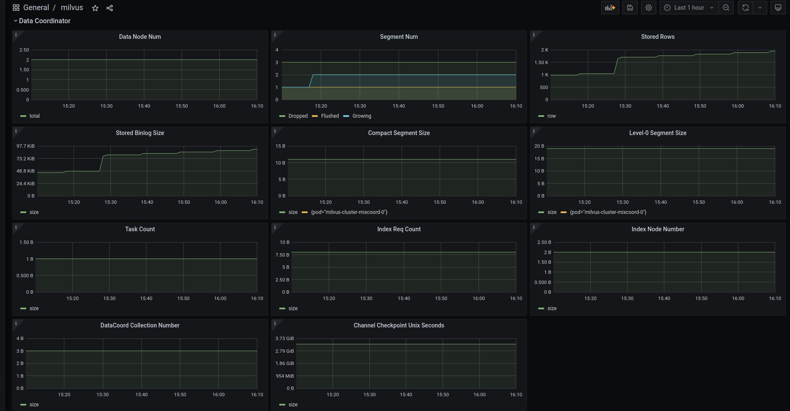
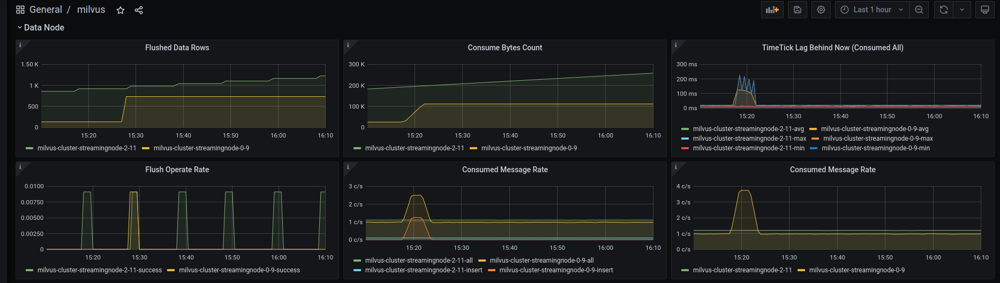
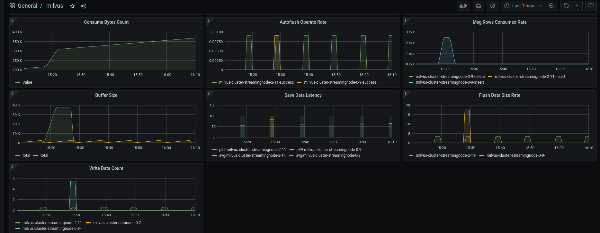
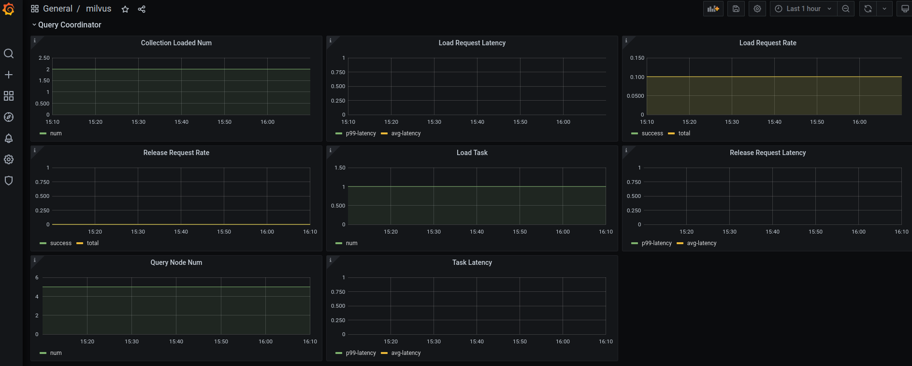
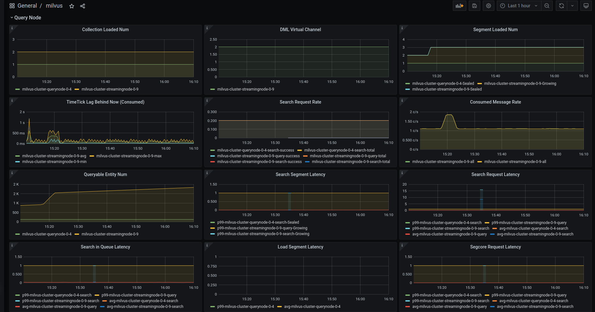
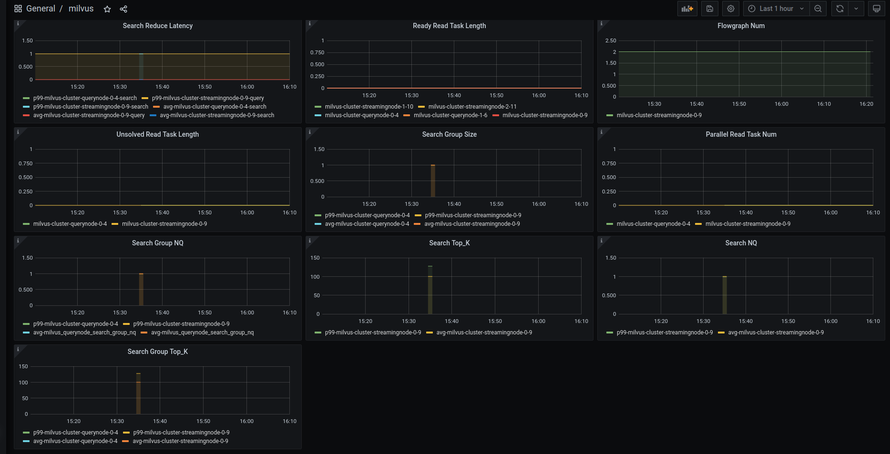
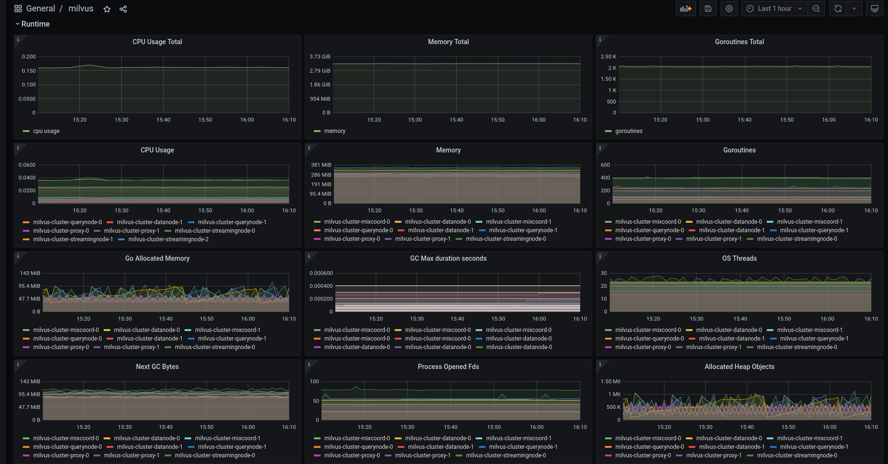
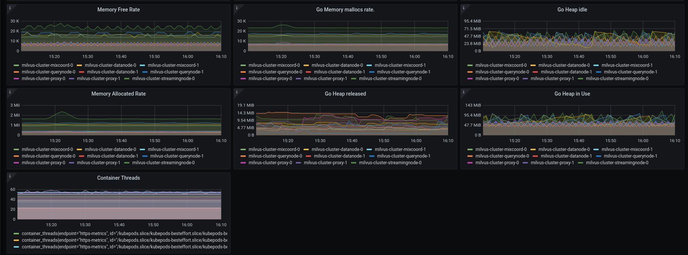


