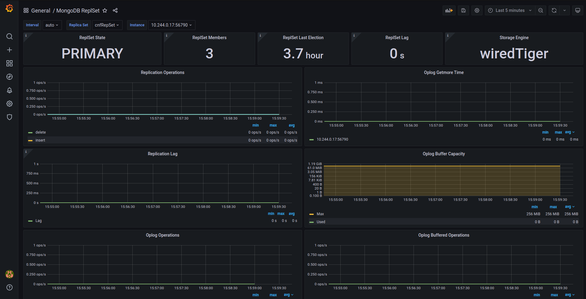

# MongoDB Grafana Dashboards

## How to Import
- First go to this url `<your-grafana-base-url>/dashboard/import`. Then click `Upload JSON file` to upload any of the dashboard json file from here.


- Then click `Import`


- Finally, you'll see a dashboard similar to the below one.


## Available Charts
| **Chart Name**  | **Usage**  |
|---|---|
| **MongoDB Instance Overview**  | This chart shows some basic graph of individual instance of the database. It is applicable for any type of MongoDB database i.e. Standalone, Replicaset Cluster or Sharded Cluster  |
| **MongoDB ReplSet**  | This chart is for MongoDB replicaSet cluster. It shows some graph for the replicaSet cluster. Sharded cluster have shard nodes and configServer nodes which are basically replicaSet, so you'll be able to see those individual replicaSet information here too. |

## Exporter

You have to turn on the compatibility mode in the exporter. You can do this by adding the following section in your CR yaml.

```
  monitor:
    prometheus:
      exporter:
        args:
          - --compatible-mode
```
